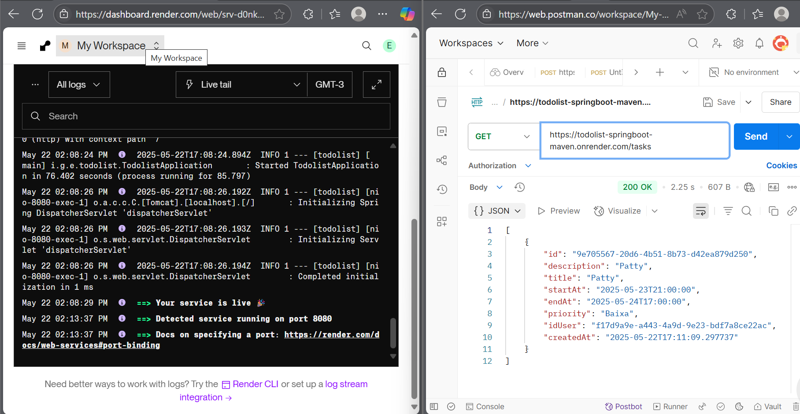

# Todolist

Gerenciador de tarefas desenvolvido em Java com Spring Boot.

<p align="center">
  
</p>

## Tecnologias Utilizadas

- **Java 21**  
  Linguagem principal do projeto.

- **Spring Boot 3.4.5**  
  Framework para desenvolvimento rápido de aplicações Java, com configuração automática e suporte a APIs REST.

- **Spring Data JPA**  
  Abstração para persistência de dados, facilitando a integração com bancos de dados relacionais.

- **H2 Database**  
  Banco de dados em memória para desenvolvimento e testes.

- **BCrypt (at.favre.lib:bcrypt)**  
  Biblioteca para hash seguro de senhas dos usuários.

- **JUnit 5**  
  Framework de testes automatizados.

- **Spring Boot DevTools**  
  Ferramenta para recarregamento automático durante o desenvolvimento.

## Funcionalidades

- **Cadastro de Usuário**

  - Criação de usuários via endpoint `/users`
  - Validação de campos obrigatórios
  - Senha armazenada de forma segura (BCrypt)
  - Verificação de existência de usuário

- **Autenticação**

  - Autenticação básica para endpoints protegidos

- **Cadastro de Tarefas**

  - Criação, listagem e atualização de tarefas via endpoints `/tasks`
  - Validação de datas (início e término)
  - Associação de tarefas ao usuário autenticado
  - Permissão de alteração apenas pelo dono da tarefa

- **Estrutura do Projeto**
  - Separação em camadas: controller, model, repository e utils
  - Uso de anotações Spring para injeção de dependências e mapeamento de entidades

## Como Executar

1. Certifique-se de ter o **Java 21** instalado.
2. Clone este repositório:
   ```sh
   git clone https://github.com/seu-usuario/todolist.git
   cd todolist
   ```
3. Execute o projeto:
   ```sh
   ./mvnw spring-boot:run
   ```
   ou, no Windows:
   ```sh
   mvnw spring-boot:run
   ```

## Exemplos de Uso

### Cadastro de Usuário

**POST** `/users`

```json
{
  "name": "Patricia",
  "username": "PatriciaPoulain",
  "password": "777"
}
```

### Cadastro de Tarefa

**POST** `/tasks`  
Autentique-se com Basic Auth usando o usuário criado.

```json
{
  "description": "Tarefa para gravar aula de tasks do curso de spring boot",
  "title": "Gravação de aula",
  "priority": "Alta",
  "startAt": "2025-05-21T17:00:00",
  "endAt": "2025-05-22T17:00:00"
}
```

### Consulta de Tarefas  
  
**GET** `/tasks`    
Autentique-se com Basic Auth usando o usuário criado. 

### Em produção

POST: https://todolist-springboot-maven.onrender.com/users  
POST: https://todolist-springboot-maven.onrender.com/tasks  
GET: https://todolist-springboot-maven.onrender.com/tasks  

## Configurações

- As configurações do banco de dados e aplicação estão em [`src/main/resources/application.properties`](src/main/resources/application.properties).
- O console do H2 pode ser acessado em `/h2-console` durante a execução.

## Testes

- Os testes automatizados estão localizados em [`src/test/java/io/github/englishwithpatricia007/todolist/TodolistApplicationTests.java`](src/test/java/io/github/englishwithpatricia007/todolist/TodolistApplicationTests.java).

